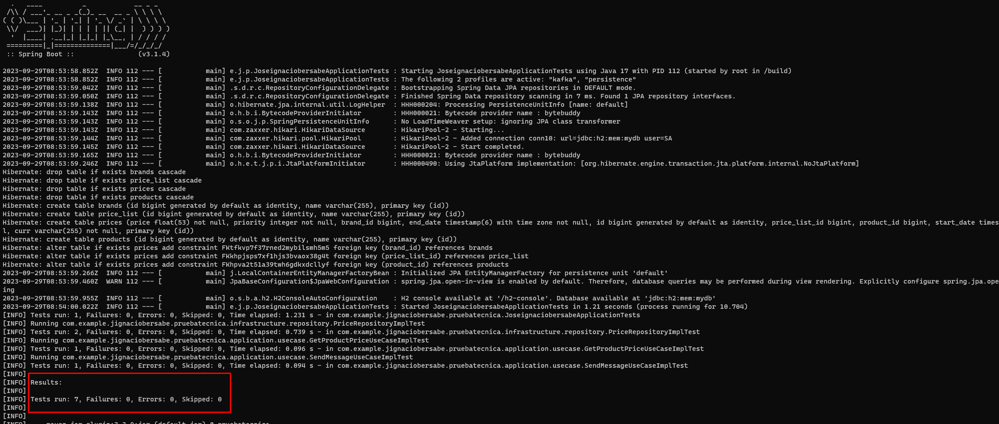
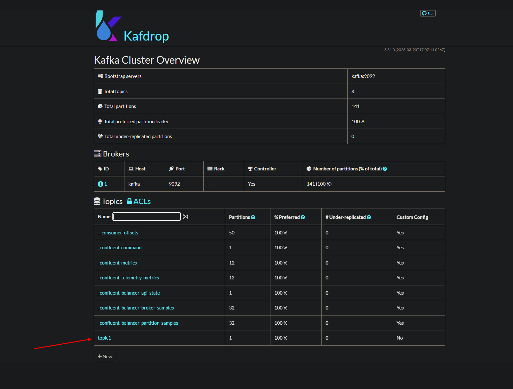

# Test project for Inditex

This is the test project that Inditex asked for me to join them

## Getting Started

These instructions will get you a copy of the project up and running on your local machine for development and testing
purposes.

### Prerequisites

* Docker and Docker-Compose

Remember that Docker Desktop is no longer allowed for businesses on free mode. I recommend using WSL and having it
installed there

### Installing

Clone the project from Git repository

```
git clone https://github.com/Igna695/pruebatecnica-itx.git
```

Execute the next command

```
docker-compose up --build -d
```

With this, we will have Kafka (with its ZooKeeper), Kafdrop (for visualizing Kafka messages),
and the project's own code containerized in the Dockerfile all up and running.

In this step, we execute the "clean install" command, which runs all the tests in the project.
You may see something like this:



## Database population

| BRAND_ID | START_DATE          | END_DATE            | PRICE_LIST | PRODUCT_ID | PRIORITY | PRICE | CURR |
|----------|---------------------|---------------------|------------|------------|----------|-------|------|
| 1        | 2020-06-14-00.00.00 | 2020-12-31-23.59.59 | 1          | 35455      | 0        | 35.50 | EUR  |
| 1        | 2020-06-14-15.00.00 | 2020-06-14-18.30.00 | 2          | 35455      | 1        | 25.45 | EUR  |
| 1        | 2020-06-15-00.00.00 | 2020-06-15-11.00.00 | 3          | 35455      | 1        | 30.50 | EUR  |
| 1        | 2020-06-15-16.00.00 | 2020-12-31-23.59.59 | 4          | 35455      | 1        | 38.95 | EUR  |

Test data is stored in a file named schema.sql, which is executed during project initiation, automating the population
of the database.

## Running the tests

To test the project, all we need to do is make a GET request to the following URL

```
http://localhost:8080/api/v1/getProducts?date=2020-06-20T16:00:00Z&productId=35455&brandId=1
```

The Kafka messages can be viewed in Kafdrop on this url:

```
http://localhost:9000
```

You may see something like this:



Only enter in topic1 and click "view messages"

## Architecture

I have chosen to implement a hexagonal architecture in the project, adhering to SOLID principles. To aid in
comprehending the package structure, I will briefly elucidate the contents of each layer.

Within the domain layer, you will find repository interfaces and use cases, which are subsequently implemented in the
application layer. The infrastructure layer manages interactions with both the database and Kafka. The apirest layer
encompasses the system's endpoints within its Controller.

I employ the Singleton pattern for constructor-based dependency injection and the Builder pattern for object creation.

For defining the API, I have employed Open API 3.0, following the API First approach, entailing the utilization of an
OpenAPI YAML file containing the API specification.

Exception handling is accomplished through a ControllerAdvice, while logging is managed via Aspects. Messages are
dispatched to a topic just prior to entering each Controller method and also in case of an error within the
ExceptionHandler.

The database itself is in-memory (H2), with Hibernate taking care of the automatic creation of table relationships.

Additionally, I leverage Lombok to streamline code and Mapstruct for efficient data mapping across layers.

## Built With

* [Spring Boot](https://spring.io/projects/spring-boot) - The framework used
* [Maven](https://maven.apache.org/) - Dependency Management
* [Java 17](https://www.oracle.com/java/technologies/javase/jdk17-archive-downloads.html) - Development language
* [Docker](https://www.docker.com/) - Contenerization

## Possible improvements

- Flyway for the database
- Externalize configurations with Spring Config
- Remove project passwords and use GitHub or cloud secrets
- Add Avro to Kafka
